# RAG System Architecture

## Overview

This document describes the comprehensive architecture of the RAG (Retrieval-Augmented Generation) system, featuring advanced document processing, intelligent query routing, and multi-modal response generation with streaming support.

## Detailed System Architecture

The following diagram illustrates the complete data flow and component interactions, styled to match professional system architecture diagrams:

```mermaid
graph LR
    %% Input sources
    DOC[📄 User Document<br/>PDF/Text]
    URL[🌐 Web URL<br/>Content]

    %% Processing pipeline (numbered steps)
    subgraph "Document Processing Pipeline"
        DP1[1️⃣ Parse Document<br/>LlamaParse/PyMuPDF]
        DP2[2️⃣ Contextualize/<br/>Enrich Text]
        DP3[3️⃣ Extract Entities<br/>& Relations]
        DP4[4️⃣ Generate Embeddings<br/>Cohere API]
        DP5[5️⃣ Create Text<br/>Embeddings Store]
    end

    %% Query processing pipeline
    subgraph "Query Processing Pipeline"
        QP1[🔍 Vector Search<br/>Qdrant DB]
        QP2[📊 Hybrid Scorer<br/>RRF Algorithm]
        QP3[🧠 Graph Traversal<br/>Knowledge Graph]
        QP4[🎯 Logical Filter<br/>Context Matching]
        QP5[⚡ Execution Engine<br/>Query Processing]
        QP6[🤖 Response Generator<br/>Cohere API]
    end

    %% Data storage
    KG[(🕸️ Knowledge Graph DB<br/>Neo4j/Neptune)]
    VEC[(🗄️ Vector DB<br/>Qdrant)]
    MEM[(💾 Short-term Memory<br/>Redis/Cachet)]

    %% Management and monitoring
    MGMT[✏️ Ontology Editor<br/>Gradio Interface]
    KG_BUILD[📈 Build & Version<br/>Knowledge Graph]
    TRACER[📋 Opik Tracer<br/>LLM Monitoring]
    ROUTER[🔀 Query Router<br/>Smart Routing]

    %% User interaction
    QUERY[❓ User Query]
    ANSWER[✅ Final Answer]

    %% Document processing flow
    DOC --> DP1
    URL --> DP1
    DP1 --> DP2
    DP2 --> DP3
    DP3 --> KG
    DP3 --> DP4
    DP4 --> DP5
    DP5 --> VEC

    %% Management flow
    MGMT --> KG_BUILD
    KG_BUILD --> KG

    %% Query processing flow
    QUERY --> ROUTER
    ROUTER --> QP1
    ROUTER --> MEM

    QP1 --> QP2
    QP2 --> QP3
    QP3 --> QP4
    QP4 --> QP5
    QP5 --> QP6

    KG -.-> QP3
    VEC -.-> QP1
    MEM -.-> QP5

    QP6 --> ANSWER

    %% Monitoring and tracing
    TRACER -.-> ROUTER
    TRACER -.-> QP6

    %% Styling to match professional architecture diagrams
    classDef input fill:#e1f5fe,stroke:#01579b,stroke-width:2px
    classDef process fill:#fff3e0,stroke:#f57c00,stroke-width:2px
    classDef storage fill:#e8f5e8,stroke:#1b5e20,stroke-width:2px
    classDef query fill:#f3e5f5,stroke:#7b1fa2,stroke-width:2px
    classDef management fill:#fce4ec,stroke:#c2185b,stroke-width:2px
    classDef output fill:#e3f2fd,stroke:#1976d2,stroke-width:2px

    class DOC,URL input
    class DP1,DP2,DP3,DP4,DP5 process
    class KG,VEC,MEM storage
    class QP1,QP2,QP3,QP4,QP5,QP6,ROUTER query
    class MGMT,KG_BUILD,TRACER management
    class QUERY,ANSWER output
```



## Architecture Components

### Document Processing Pipeline

**1️⃣ Parse Document**
- **LlamaParse API**: Advanced document understanding with layout preservation
- **PyMuPDF**: High-fidelity PDF text extraction with formatting
- **Tesseract OCR**: Multi-language image text recognition
- **Multi-format support**: PDF, images (PNG/JPG), URLs, text files

**2️⃣ Contextualize/Enrich Text**
- **Context preservation**: Maintain document structure and metadata
- **Content enhancement**: Semantic enrichment and normalization
- **Quality filtering**: Remove noise and irrelevant content

**3️⃣ Extract Entities & Relations**
- **Named Entity Recognition**: Extract people, organizations, locations, dates
- **Relationship mapping**: Identify connections between entities
- **Knowledge graph population**: Neo4j/Neptune integration for graph storage

**4️⃣ Generate Embeddings**
- **Cohere embed-english-v3.0**: State-of-the-art 1024-dimensional embeddings
- **Input type optimization**: 'search_document' for document chunks, 'search_query' for user queries
- **Batch processing**: Efficient vector generation for multiple texts

**5️⃣ Create Text Embeddings Store**
- **Qdrant vector database**: High-performance similarity search with filtering
- **Metadata indexing**: Document source, chunk position, entity information
- **Optimized indexing**: Efficient vector operations with HNSW indexing

### Query Processing Pipeline

**🔍 Vector Search**
- **Semantic similarity**: Cosine similarity with configurable thresholds (0.1)
- **Multi-vector retrieval**: Top-10 candidates with hybrid scoring
- **Metadata filtering**: Filter by document source, date, entity types

**📊 Hybrid Scorer (RRF)**
- **Reciprocal Rank Fusion**: Combines vector similarity and relevance scores
- **Score normalization**: Consistent scoring across different retrieval methods
- **Dynamic weighting**: Adaptive scoring based on query type and context

**🧠 Graph Traversal**
- **Knowledge graph queries**: Entity-centric search using Neo4j/Neptune
- **Relationship following**: Multi-hop entity connection traversal
- **Context expansion**: Discover related concepts and entities

**🎯 Logical Filter**
- **Query intent analysis**: Determine factual, informational, or conversational queries
- **Context relevance scoring**: Filter chunks based on topical relevance
- **Answer extraction**: Identify chunks containing direct answers

**⚡ Execution Engine**
- **Query planning**: Optimal execution strategy selection
- **Resource management**: Efficient API usage and rate limiting
- **Performance optimization**: Minimize latency through parallel processing

**🤖 Response Generator**
- **Cohere Command R+**: Primary LLM with streaming support
- **Context integration**: Incorporate top-ranked chunks for accurate responses
- **Response streaming**: Real-time text generation with 50ms chunk updates

## Data Storage Architecture

### Vector Database (Qdrant)
```
Document Chunks → Embedding Generation → Qdrant Storage → Similarity Search
     ↓                    ↓                    ↓              ↓
Text Processing → Cohere API (embed-english-v3.0) → Index Creation → Query Processing
```

### Knowledge Graph (Neo4j/Neptune)
```
Entities → Relationships → Graph Traversal → Context Enhancement
   ↓           ↓              ↓                   ↓
NER/RE → Storage → Query Processing → Response Generation
```

### Memory System (Redis)
```
Conversation History → Context Retrieval → Response Enhancement
     ↓                     ↓                    ↓
Session Management → Short-term Memory → Persistent Context
```

## Technology Integration

### External API Services
- **Cohere API**: Primary LLM (Command R+) and embedding services (embed-english-v3.0)
- **Groq API**: High-speed inference fallback (120B model)
- **LlamaParse**: Advanced document understanding and parsing
- **Qdrant Cloud**: Managed vector database with enterprise features

### Monitoring and Observability
- **Opik Tracer**: LLM call monitoring, performance tracking, and error analysis
- **Structured Logging**: Detailed operation logging with configurable levels
- **Health Checks**: Automatic service availability monitoring
- **Metrics Collection**: Query performance, response times, and API usage analytics

## Deployment Architecture


## Security and Performance

### Security Measures
- **API Key Management**: Secure storage in Azure Key Vault
- **Input Validation**: Comprehensive sanitization and size limits
- **HTTPS Encryption**: All external communications encrypted
- **Access Control**: Azure AD integration with role-based access

### Performance Optimizations
- **Async Processing**: All I/O operations use async/await for concurrency
- **Connection Pooling**: Efficient database and API connection management
- **Caching Strategy**: Redis for conversation context and query results
- **Batch Processing**: Vector operations processed in optimized batches
- **Streaming Responses**: Real-time response generation reducing perceived latency

## Monitoring and Analytics

### Performance Metrics
- **Query Response Time**: End-to-end latency tracking (target: <2s)
- **Vector Search Performance**: Similarity search speed and accuracy
- **LLM API Usage**: Token consumption, cost monitoring, and rate limits
- **Memory Usage**: Redis cache efficiency and hit rates

### Quality Metrics
- **Response Relevance**: User feedback integration and automated scoring
- **Context Retrieval Quality**: Chunk relevance and coverage analysis
- **System Accuracy**: Answer correctness evaluation using multiple metrics

This architecture provides a production-ready, enterprise-grade RAG system with comprehensive documentation, monitoring, and optimization strategies for reliable deployment and scaling.