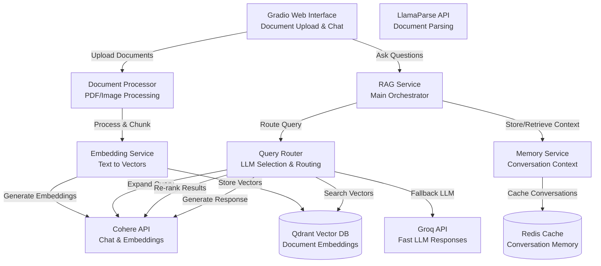

# 🚀 RAG System - Vector-Based Document Q&A

A production-ready Retrieval-Augmented Generation system that processes PDF documents, images, and URLs to answer questions intelligently.

## 🌟 Key Features

- **Multi-Modal Input Support**: PDF documents, images (OCR), and web URLs
- **Intelligent Vector Search**: Qdrant-based semantic search with Cohere embeddings
- **Dual LLM Architecture**: Groq (primary) with Cohere fallback for reliability
- **Conversation Memory**: Redis-based persistent conversation history
- **Web Interface**: Modern Gradio UI for easy interaction
- **Azure Ready**: Simple deployment to Azure without Docker/Kubernetes

## 🛠️ Technology Stack

| Component | Technology | Purpose |
|-----------|------------|---------|
| **Vector Database** | Qdrant | High-performance similarity search |
| **Primary LLM** | Cohere Command R+ | Response generation with streaming |
| **Embedding Model** | Cohere embed-english-v3.0 | Semantic vector generation |
| **Re-ranking** | Cohere rerank API | Context relevance scoring |
| **PDF Processing** | LlamaParse | Advanced document parsing |
| **Web Scraping** | trafilatura + firecrawl | URL content extraction |
| **OCR** | Tesseract | Image text extraction |
| **Memory** | Redis | Conversation persistence |
| **UI** | Gradio | Web interface with streaming |
| **Query Processing** | Intelligent routing & expansion | Enhanced context retrieval |

## 🚀 Quick Start

### 1. Installation

```bash
# Clone and navigate to the project
cd rag_system

# Install dependencies
pip install -r requirements.txt

# Copy environment template
cp .env.example .env

# Edit .env with your API keys
nano .env
```

### 2. Configure API Keys

Edit `.env` and add your API keys:

```env
# Required
COHERE_API_KEY=your_cohere_api_key
GROQ_API_KEY=your_groq_api_key

# Optional (for enhanced features)
FIRECRAWL_API_KEY=your_firecrawl_api_key
OPIK_API_KEY=your_opik_api_key

# Vector Database (local Qdrant)
QDRANT_URL=http://localhost:6333

# Redis (local Redis)
REDIS_HOST=localhost
REDIS_PORT=6379
```

### 3. Launch the System

#### Web Interface (Recommended)
```bash
python main.py --web
```
Then open http://localhost:7860 in your browser.

#### CLI Mode
```bash
python main.py --cli
```

## 📖 Usage Guide

### Web Interface

1. **Upload Documents**
   - Click "Document Upload" tab
   - Upload PDF files or enter URLs
   - Wait for processing to complete

2. **Ask Questions**
   - Go to "Ask Questions" tab
   - Type your question
   - Get intelligent answers based on uploaded content

3. **Start New Conversations**
   - Click "New Conversation" for fresh context

### CLI Mode

```bash
Your question: What is the main topic of the document?
🤔 Thinking...
==================================================
Answer: The document discusses artificial intelligence and machine learning...
==================================================

Your question: status
📊 System Status
==============================
Service Ready: ✅
Documents Processed: 3
Vector Store: 127 vectors
```

## 🔧 Supported Input Types

### PDF Documents
- Automatic text extraction using LlamaParse
- Intelligent layout understanding
- Table and image caption extraction

### Images
- OCR using Tesseract
- Supports PNG, JPG, JPEG, GIF, BMP
- Automatic text extraction from images

### URLs
- Web scraping with trafilatura (fallback)
- Firecrawl API for modern websites (if available)
- Automatic content extraction and cleaning

## 🏗️ System Architecture

For a detailed architectural overview including component descriptions, data flow diagrams, and deployment architecture, see [ARCHITECTURE.md](ARCHITECTURE.md).

### High-Level Architecture



## 🚀 Azure Deployment

### Automatic Deployment

```bash
# Make deployment script executable
chmod +x azure-deploy.sh

# Deploy to Azure
./azure-deploy.sh
```

### Manual Deployment

```bash
# 1. Create Azure resources
az group create --name RAG-System --location eastus

# 2. Create storage account
az storage account create --name mystorage --resource-group RAG-System --sku Standard_LRS

# 3. Create Redis cache
az redis create --name myredis --resource-group RAG-System --sku Basic --vm-size C1

# 4. Create web app
az webapp up --name my-rag-app --resource-group RAG-System --runtime "PYTHON:3.11"

# 5. Set environment variables
az webapp config appsettings set --name my-rag-app --resource-group RAG-System \
    --setting COHERE_API_KEY="your-key" GROQ_API_KEY="your-key"
```

## 🔧 Configuration

### Environment Variables

| Variable | Description | Default |
|----------|-------------|---------|
| `COHERE_API_KEY` | Cohere API key (required) | - |
| `GROQ_API_KEY` | Groq API key (required) | - |
| `QDRANT_URL` | Qdrant server URL | http://localhost:6333 |
| `REDIS_HOST` | Redis server hostname | localhost |
| `CHUNK_SIZE` | Text chunk size | 1000 |
| `MAX_FILE_SIZE_MB` | Maximum upload size | 10 |

### Vector Database Options

#### Local Qdrant (Development)
```bash
# Start Qdrant locally
docker run -p 6333:6333 qdrant/qdrant
```

#### Cloud Qdrant (Production)
```env
QDRANT_URL=https://your-project.cloud.qdrant.io
QDRANT_API_KEY=your_qdrant_api_key
```

## 📊 Monitoring & Observability

### Built-in Logging
- All operations logged to `rag_system.log`
- Configurable log levels (DEBUG, INFO, WARNING, ERROR)

### Opik Integration (Optional)
```env
OPIK_API_KEY=your_opik_key
OPIK_PROJECT_NAME=rag_system
```
- Automatic LLM call tracing
- Performance monitoring
- Error tracking

### Health Checks
```bash
# Check system status via CLI
python main.py --status

# Or via web interface "System Status" button
```

## 🛠️ Development

### Project Structure

```
rag_system/
├── config/                 # Configuration management
│   └── settings.py
├── core/                   # Core processing logic
│   └── document_processor.py
├── services/               # Business logic services
│   ├── embedding_service.py
│   ├── query_router.py
│   ├── memory_service.py
│   └── rag_service.py
├── database/               # Database integrations
│   └── vector_store.py
├── ui/                     # User interfaces
│   └── gradio_app.py
├── main.py                 # Entry point
├── requirements.txt        # Dependencies
├── azure-deploy.sh         # Azure deployment script
└── README.md              # This file
```

### Adding New Features

1. **New Document Types**: Extend `DocumentProcessor` class
2. **New Embeddings**: Modify `EmbeddingService` class
3. **New LLMs**: Update `QueryRouter` class
4. **New Databases**: Implement in `database/` directory

## 🔒 Security Considerations

- API keys stored securely in environment variables
- File upload size limits to prevent abuse
- Input validation and sanitization
- Azure security features (HTTPS, authentication)

## 📈 Performance Optimization

- **Async Processing**: All I/O operations are asynchronous
- **Connection Pooling**: Efficient database connections
- **Chunking Strategy**: Intelligent text splitting for better retrieval
- **Caching**: Redis conversation memory reduces redundant processing

## 🆘 Troubleshooting

### Common Issues

1. **Import Errors**: Ensure all requirements are installed
   ```bash
   pip install -r requirements.txt
   ```

2. **API Key Issues**: Verify keys in `.env` file
   ```bash
   python -c "from config.settings import settings; settings.validate()"
   ```

3. **Qdrant Connection**: Check if Qdrant is running locally
   ```bash
   docker ps | grep qdrant
   ```

4. **Memory Issues**: Clear Redis data if needed
   ```python
   # In Python console
   from services.memory_service import MemoryService
   import asyncio
   asyncio.run(MemoryService().cleanup_expired_sessions())
   ```

## 🤝 Contributing

1. Fork the repository
2. Create a feature branch
3. Make your changes
4. Test thoroughly
5. Submit a pull request

## 📄 License

MIT License - see LICENSE file for details.

## 🆘 Support

For issues and questions:
1. Check the troubleshooting section
2. Review the logs in `rag_system.log`
3. Open an issue on GitHub

---

**Happy Document Questioning! 🚀**